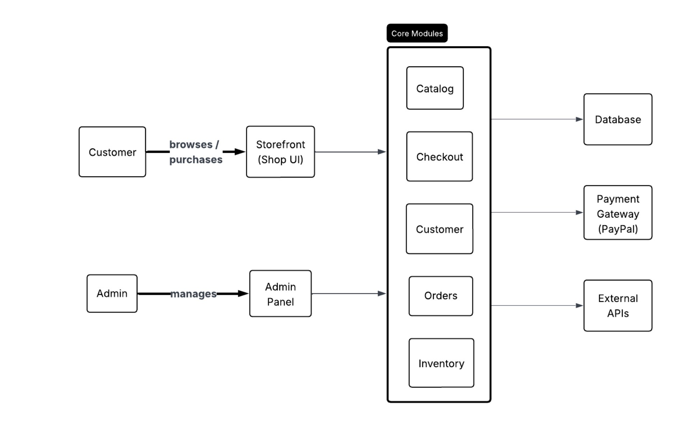
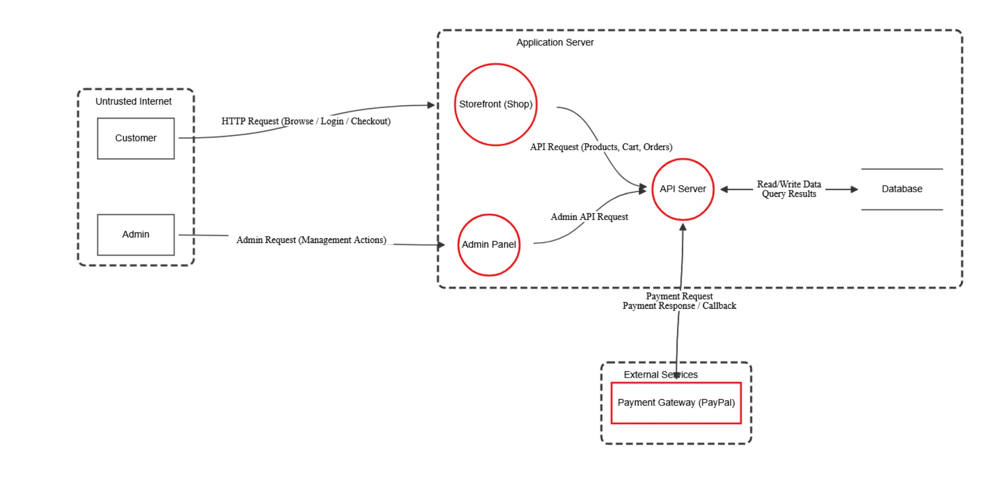
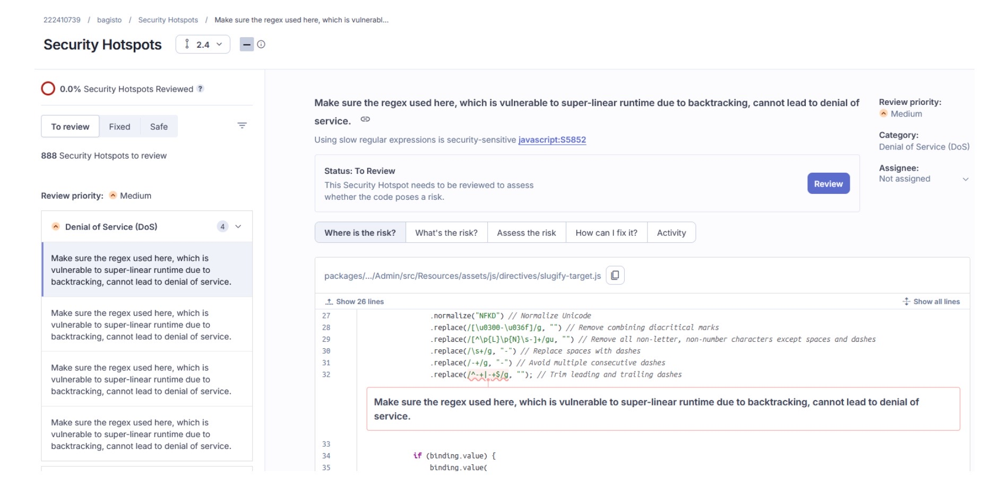

# Bagisto Security Assessment

A secure software development assessment of **Bagisto**, an open-source e-commerce platform.

This university project was completed as part of the **Secure Software Development (CYS402)** course. The project evaluates Bagisto from a cybersecurity perspective through security risk analysis, threat modeling, security requirements, architecture analysis, manual code review, and automated static analysis.

## Project Overview

E-commerce platforms process sensitive information such as customer data, authentication credentials, order records, payment information, and business data. Because of this, security weaknesses can result in data breaches, financial loss, unauthorized access, and service disruption.

This project analyzes the security of the Bagisto e-commerce platform through multiple phases of the secure software development lifecycle.

## Security Assessment Methodology

The assessment was completed in four main phases.

### Phase 1 – Security Risk Analysis

- Analyzed the Bagisto e-commerce domain
- Identified significant security risks
- Examined sensitive data handled by the platform
- Evaluated existing protection measures
- Identified potential security weaknesses
- Analyzed the potential consequences of security failures

### Phase 2 – Assets, Threats & Security Requirements

- Identified and prioritized critical system assets
- Analyzed potential malicious actors
- Applied the **STRIDE threat model**
- Mapped security threats to the **CIA Triad**
- Evaluated potential exploitation methods
- Defined security goals
- Developed security requirements using **SQUARE-Lite**
- Prioritized security requirements based on risk

Key assets analyzed included:

- Authentication data
- Payment data
- Customer personal data
- Order records
- Business configuration data
- Inventory data

### Phase 3 – Architecture & Threat Modeling

The system architecture and security-sensitive components of Bagisto were analyzed.

The assessment included:

- System architecture analysis
- Security-sensitive subsystem identification
- Security risk analysis
- Trust boundary analysis
- Threat identification and mitigation
- Asset-to-threat mapping
- Detailed security design analysis
- Evaluation of security design principles

A threat model was created using **OWASP Threat Dragon** and the **STRIDE framework** to analyze threats across system components and data flows.

High-risk areas included:

- Authentication and Admin Panel
- Payment and Checkout
- API Layer

The project also evaluated security principles and design patterns including:

- Role-Based Access Control (RBAC)
- Defense in Depth
- Separation of Concerns
- Secure by Design
- Model-View-Controller (MVC)
- Repository Pattern

## Security Assessment Visuals

### System Architecture

The high-level architecture illustrates the main Bagisto components, users, core modules, database, payment gateway, and external APIs.

### Threat Model

The threat model was developed using **OWASP Threat Dragon** to visualize system components, data flows, trust boundaries, and potential security threats.

### SonarCloud Security Analysis

**SonarCloud** was used to perform automated static analysis and identify security issues and hotspots for further investigation.

### Phase 4 – Secure Code Review & Static Analysis

The final phase evaluated Bagisto at the source-code level using both **manual code review** and **SonarCloud static analysis**.

Critical functions related to the following areas were manually reviewed:

- Admin authentication
- Customer authentication
- Cart and session management
- Payment processing

Automated analysis using **SonarCloud** was also performed to identify and evaluate security issues and hotspots.

Security findings investigated by the team included:

- Authentication security issue
- Regular Expression Denial of Service (ReDoS)
- Open Redirect
- Permissive CORS policy

For each finding, the security impact and potential mitigation were analyzed.

## Tools & Security Concepts

- OWASP Threat Dragon
- SonarCloud
- STRIDE Threat Modeling
- CIA Triad
- SQUARE-Lite
- Manual Secure Code Review
- Static Application Security Testing (SAST)
- Asset & Risk Analysis
- Security Requirements Engineering
- Threat Modeling
- Role-Based Access Control (RBAC)
- Defense in Depth
- Secure Software Development

## My Contribution

As part of the project team, my contributions included work across multiple phases of the security assessment.

My work included:

- Asset mapping and security analysis
- Development of security requirements
- Analysis of security controls and mitigation strategies
- Manual review of the **Cart Merge** function
- Investigation of an **Open Redirect** finding identified through SonarCloud

Security requirements I worked on included:

- Logging successful and unsuccessful administrator login attempts
- Logging privileged administrator actions for accountability
- CAPTCHA verification after repeated unsuccessful authentication attempts
- Verification of authorized payment callbacks
- Disabling installation and setup routes after production deployment

## Key Security Areas

### Authentication Security

Protection of customer and administrator accounts against unauthorized access, brute-force attacks, and authentication weaknesses.

### Access Control

Evaluation of administrative permissions, role-based access control, and the principle of least privilege.

### Payment Security

Analysis of payment processing, callbacks, transaction integrity, and risks associated with external payment services.

### Input Security

Analysis of risks associated with improper input handling and common web application vulnerabilities.

### Availability

Analysis of denial-of-service risks, rate limiting, and resource-intensive operations.

### Logging & Monitoring

Evaluation of security logging for authentication events, privileged actions, payments, and incident investigation.

## Full Project Report

The complete CYS402 security assessment, including threat models, security requirements, architecture analysis, code reviews, and SonarCloud findings, is available here:

[View the Full Security Assessment Report](report/CYS402-Project-Final-Report.pdf)

## Academic Project

This project was completed by a team of four Computer Science students as part of the **Secure Software Development (CYS402)** course at Prince Sultan University.

## Disclaimer

This repository contains an academic security assessment of the open-source Bagisto platform. The Bagisto software itself was not developed by our team. The project focuses on analyzing its architecture, security risks, requirements, source code, and potential security improvements.
